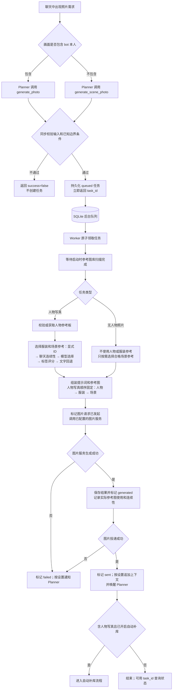
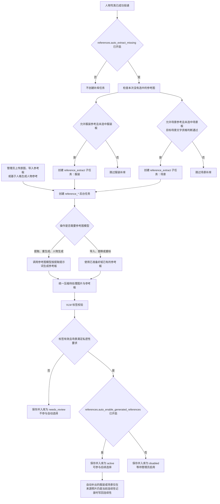

# 麦麦写真 · 让麦麦更真实地发送照片

`麦麦写真`（Manifest ID：`maitu.photo-studio`）为 MaiBot 提供可配置的照片生成、参考图库与异步投递能力。它将照片请求保存为后台任务，按需选择参考图，生成完成后把图片发送回原聊天。插件本身不提供模型、网关或额度；图片由使用者配置的服务生成。

## 使用前须知

### 使用范围与责任

本插件会按照配置向使用者指定的第三方图像服务提交请求。模型输出可能出现偏差、失败，或不适合特定用途，不能替代人工审核。启用前请在测试环境核对模型、请求方式、管理员权限、提示词、参考图和图片投递行为。

部署者应确保输入数据、生成内容及其使用符合适用法律、平台规则、服务商条款和组织政策，并自行管理 API 凭据与数据保留。插件不对第三方服务的可用性、输出质量或特定用途适配性作出保证。

### 费用与调用控制

插件不提供第三方模型额度，也不决定第三方服务的计费规则。图片生成、人物/服装/场景参考图的提取或生成、自动补库，以及标签和参考图选择等辅助模型任务，都可能触发已配置的服务调用。

具体的计费项目、额度、并发限制、速率限制，以及失败或重试请求是否计费，均以实际服务商或中转服务的控制台、账单和条款为准；HTTP 状态码不能作为计费结论。正式使用前，请核对模型 ID 与请求方式，设置合理的调用频率和重试策略，并持续关注用量与账单。

## 高度可定制

默认提示词只是一个起点，并不限定插件只能生成某一种风格。WebUI 的 `LLM 提示词` 配置组开放了照片生成、参考图提取、标签判断、参考图选择和 Planner 通知相关的提示词；无需修改代码，即可通过调整提示词改变模型的倾向。在服务商能力允许的范围内，使用者可以将插件调校为符合自身角色设定、画面风格和照片规则的效果。

| 想调整的内容 | 主要配置项 | 作用 |
| --- | --- | --- |
| 人物写真与环境照的画面风格 | `photo_system`、`photo_user`、`scene_photo_system`、`scene_photo_user`、`negative_prompt` | 调整镜头感、构图、光线、描述方式和负面限制。 |
| 人物、服装与场景的参考约束 | `person_reference_prompt`、`outfit_reference_prompt`、`scene_reference_prompt` 及对应回退提示词 | 明确每类参考图应保留或忽略哪些信息。 |
| 参考图的提取方式 | `extract_person`、`generate_person_from_personality`、`extract_outfit`、`extract_scene` | 描述期望的布局、角度和保留内容；README 不固定这些规则。 |
| Planner 对工具的理解 | `generate_photo_*`、`generate_scene_photo_*`、`status_*` | 影响 Planner 对工具的理解与选择倾向，以及如何填写工具参数；这不会直接改变图片模型的输出。 |

编辑模板时，应保留 WebUI 字段提示中列出的 `{...}` 占位符，以便插件填入当前任务的描述和参考约束；不要新增未说明的占位符，已停用的 `reference_labels` 也不能再使用。提示词用于引导模型，实际结果仍受模型能力、参考图质量和服务商实现影响。建议每次修改后先用低成本请求验证效果。

## 核心能力

| 能力 | 说明 |
| --- | --- |
| 人物写真 | Planner 可使用 `generate_photo` 生成 bot 本人出镜的生活照，并按配置使用人物、服装和合格私密室内场景参考。 |
| 无人物照片 | Planner 可使用 `generate_scene_photo` 生成房间、景物或物品等不含 bot 本人的图片。 |
| 参考图库 | 人物、服装和场景参考图分别管理；图片会压缩、打标并按状态控制是否可用。 |
| 聊天连续性 | 同一聊天流可在有效期内优先复用服装和场景参考；不同平台、账号或路由不会共享记录。 |
| 异步任务 | 任务、结果、实际使用的参考图和投递状态均会保存，可在重载后继续查询、重试或处理。 |
| 自动补库 | 人物写真成功投递后，可异步补充本次缺失的服装或场景参考，不阻塞图片发送。 |

## 工具与执行方式

| 使用场景 | 工具 | 行为 |
| --- | --- | --- |
| bot 本人出镜的自拍、他拍或生活照 | `generate_photo` | 默认使用全局人物参考板，并可复用服装和合格场景参考。 |
| 不含 bot 本人的房间、景物或物品照片 | `generate_scene_photo` | 不使用人物或服装参考，可按需使用合格场景参考。 |
| 查询异步任务 | `get_image_task_status` | 返回任务状态；启用 `include_image` 时可附带已生成图片。 |

所有生图工具均异步执行。参数、权限和配置校验通过后，工具会立即返回 `{success, task_id, status}`；这只表示任务已入队，不代表图片已经生成或发送。后台 worker 随后完成生图和投递。校验失败会同步返回错误且不会创建任务，同一需求不应重复提交。

## 运行要求

- MaiBot `>=1.1.4,<2.0.0`
- Python `>=3.12`
- MaiBot Plugin SDK `>=2.7.1,<3.0.0`
- 支持 Images API 或 Chat Completions 的 OpenAI 兼容图片服务
- MaiBot 中可用的 `vlm` 模型任务（参考图标签）和 `utils` 模型任务（场景判断与图库选择）

在 WebUI 中填入服务商实际支持的模型 ID。`openai.base_url` 可带或不带 `/v1`。`generation_mode` 与 `reference_mode` 由用户按服务商选择，插件不会按模型名自动改用其他请求方式，也不会在失败后换模式重试：

| 请求方式 | 适用 |
| --- | --- |
| `images_api` | OpenAI Images。文生图走 `/images/generations` JSON；有参考图时走 multipart `/images/edits`（gpt-image 等）。 |
| `images_json` | 同样使用 Images API，但参考图以 JSON data URL 发送（Grok Imagine 等；可避免 multipart 的 415）。 |
| `chat_completions` | 多模态聊天生图（Gemini 等），会请求图片输出。 |

### 图片输出参数

`openai` 配置组为普通写真/环境照和参考板提供两套彼此独立的 Images 参数：

| 用途 | 分辨率 | 质量 | 输出格式 | 审核强度 | 额外请求字段 |
| --- | --- | --- | --- | --- | --- |
| 写真与环境照 | `generation_size` | `generation_quality` | `generation_output_format` | `generation_moderation` | `generation_extra_params` |
| 人物、服装、场景参考板 | `reference_size` | `reference_quality` | `reference_output_format` | `reference_moderation` | `reference_extra_params` |

这些字段默认留空（额外参数默认为空对象），以便旧配置继续由服务商决定默认行为。分辨率可填写 `auto` 或 `WIDTHxHEIGHT`；质量可选 `auto/low/medium/high/xhigh/max/standard/hd`，输出格式可选 `png/jpeg/webp`，审核强度可选 `auto/low`。具体可用值仍以所选模型和兼容服务商为准。

生图工具显式传入的 `size` 优先于 `generation_size`；参考图提取、生成或重生成管理员命令中的 `分辨率=`（也可写 `size=`）优先于 `reference_size`。例如：

```text
/maitu 人物 提取 分辨率=1024x1024
/maitu 参考 重生成 <参考图ID> size=1536x1024
```

`generation_extra_params` 和 `reference_extra_params` 是 JSON 对象，只能补充请求体字段。为防止绕过插件管理，不能包含 `model`、`prompt`、`n`、`size`、`quality`、`output_format`、`moderation`、`response_format`、`negative_prompt`、`image`、`images` 或 `messages` 等字段。`images_api` 与 `images_json` 会发送 Images 专用参数；`chat_completions` 不发送质量、输出格式和审核强度，但仍保留既有的 `size` 与额外 JSON 透传。GPT Image 请求默认不再强制发送 `response_format=b64_json`，插件仍能解析服务商返回的 URL 或 base64 图片。

### 辅助模型 RPC 与图库候选数量

`model_tasks.rpc_timeout_seconds` 控制标签、场景判断和图库选择等 MaiBot 辅助模型调用的 `cap.call` RPC 超时，默认 30 秒。它与 `openai.request_timeout_seconds` 相互独立：前者等待 MaiBot 的 `llm.generate` 能力返回，后者等待插件直接请求 OpenAI 兼容生图服务。辅助模型响应较慢并出现 `[E_TIMEOUT] 请求 cap.call 超时` 时，可在 WebUI 中调高前者。

`model_tasks.selection_candidate_limit_per_category` 控制每次图库选择分别传给辅助模型的服装和场景候选数量，默认每类 12 条；两类都需要选择时最多传入 24 条候选元数据。它不改变最终生图使用的参考图数量和顺序，人物、服装、场景仍各最多一张，并保持人物 → 服装 → 场景。

## 安装

将仓库放入 MaiBot 第三方插件目录，保留下面的结构：

```text
MaiBot/plugins/maitu-photo-studio/
  _manifest.json
  plugin.py
  requirements.txt
  README.md
  LICENSE
  maitu_photo/
```

MaiBot 运行环境若未预装依赖，可执行：

```powershell
python -m pip install -r requirements.txt
```

## 首次使用

1. 在 MaiBot 加载或重载插件，然后打开 WebUI 的 `麦麦写真` 配置页。
2. 配置 `plugin.admin_user_ids`。建议按 `platform:user_id` 填写，例如 `qq:123456`；只有这里列出的用户可以执行 `/maitu` 管理命令和受限图库操作。旧版宿主未提供 `platform` 时才使用裸 ID。
3. 配置 `openai.base_url`、`openai.api_key`、`openai.generation_model`、`openai.reference_model`、两种接口模式，以及 MaiBot 的 `model_tasks.tagging_task_name`（通常为 `vlm`）和 `model_tasks.selection_task_name`（通常为 `utils`）。
4. 保存后重载插件，再由管理员执行：

   ```text
   /maitu 诊断
   ```

   诊断会显示配置状态、模型、参考图和排队任务摘要，但不会输出 API Key 内容。
5. 默认启用“强制要求人物参考图”。先把一张图片与下列命令放在同一条消息中，或回复一条只含单张图片的消息后发送命令：

   ```text
   /maitu 人物 提取
   ```

   也可以使用 `/maitu 人物 导入` 导入已处理好的人物参考图，或在没有人物图时使用 `/maitu 人物 生成`，根据 MaiBot 昵称和人格设定生成。

   默认行为：`references.person_reference_enabled=true` 且 `references.require_person_reference=true` 时，必须存在可用且已启用的人物参考图，否则人物写真任务会被拒绝。

   缺图时的文字回退：关闭 `references.require_person_reference` 后，缺少人物参考图时会改用 MaiBot 的昵称和人格文字。

   关闭人物参考：关闭 `references.person_reference_enabled` 后，默认不传人物参考图，而是使用文字人物描述。若工具显式传入 `use_person_reference=true`，插件仍会尝试使用人物参考图；同时开启严格要求且没有可用参考图时，任务仍会被拒绝。
6. 可选地导入服装与私密室内场景参考图。普通照片或原图使用“提取”；已经按自身提示词规则整理好的参考图使用“导入”：

   ```text
   /maitu 参考 提取 服装 名称=夏日连衣裙
   /maitu 参考 导入 场景 名称=卧室窗边
   ```

   场景参考只接受卧室、浴室、客厅等室内私密小空间；咖啡店、商场、街道、办公室等不会参与生图。
7. **可选：让 Planner 主动调用工具。** 在 MaiBot 本机的 `bot_config.toml` 中，将下面一行追加到现有 `behavior_style` 文本。沿用当前配置的 TOML 引号或多行写法，不要覆盖已有行为设定：

   ```text
   你可以调用generate_scene_photo和generate_photo工具生成照片
   ```

   这是可选的行为建议。不添加也不影响插件安装、配置或手动调用。`bot_config.toml` 是 MaiBot 的运行配置，不要提交到 Git。
8. 让 Planner 调用对应工具，并使用返回的 `task_id` 查询进度。图片成功投递后，默认会追加上下文并唤醒 Planner；可通过 `output.notify_planner` 关闭。

### 生图失败重试

- `openai.generation_max_retries`：失败后的额外尝试次数，范围为 `0..5`，默认值为 `0`。只有网络错误、HTTP 429 和 HTTP 5xx 会重试；配置校验、响应解析和图片解码错误会立即失败。
- `openai.generation_retry_backoff_seconds`：指数退避的基础等待时间，范围为 `0..60` 秒，默认值为 `1` 秒。每次重试都会记录不含密钥的错误类别、HTTP 状态、尝试次数和等待时间。重试会产生新的请求尝试，但是否计费（包括 HTTP 503 等失败响应）完全由服务商或中转服务决定，不能仅凭状态码判断；启用前请以该服务的计费规则和账单为准。

### 日志与诊断

日志由 MaiBot 宿主统一接收、轮转和保留。`logging.enabled` 默认开启；`logging.minimum_level` 可设为 `DEBUG`、`INFO`、`WARNING` 或 `ERROR`。日志会覆盖插件加载、任务入队、图片服务请求、重试、生成、投递、Planner 通知、参考图处理和清理，并包含任务 ID、任务类型、聊天流和安全的错误类别。

为保护隐私，插件不会记录 API Key、Authorization、完整提示词、人格文本、原始消息、图片内容或任务载荷；即使异常文本意外包含常见密钥形式，也会在写入日志前脱敏。宿主自身的日志级别仍可能进一步过滤插件日志。

升级到含新配置字段的版本后，请先重载插件。MaiBot 会根据 `plugin.config_version` 补齐已有 `config.toml` 缺失的默认字段，并保留仍兼容的已有配置值；若 WebUI 尚未显示新项，刷新页面后重新打开插件配置。Docker 部署可通过 `docker logs <core-container>` 查看宿主日志，非容器部署可查看 MaiBot 的 `data/MaiMBot/logs/` 目录。

## 工具选择

### `generate_photo`

用于 bot 本人出镜的真实生活照。`description` 应一次说明动作、表情、服装、配饰、地点、光线、构图与氛围；可用 `outfit_hint`、`scene_hint`、`accessory_hint` 补充信息。

**人物参考**

- 有可用人物参考图时，它始终作为第一张参考图。
- 在 `person_reference_enabled=true` 且 `require_person_reference=true` 时，缺少可用人物参考图，或显式传入 `use_person_reference=false`，都会拒绝任务。关闭 `require_person_reference` 后，缺图时才会回退到 MaiBot 的昵称和人格文字。

**服装与场景**

- 有服装参考图时由参考图控制服装；没有合适参考时使用 `clothing_style_prompt` 和文字提示回退。
- 场景参考只在目标被判定为合格的私密室内空间时使用。

**聊天连续性**

所有群聊和私聊都按 MaiBot 的标准聊天流 ID（`stream_id`）隔离。不同平台、账号或路由即使有相同的目标 ID，也不会共享状态。默认在同一自然日、相同场景指纹且 12 小时内优先复用服装和场景参考；管理员可以固定或重置连续性。

### `generate_scene_photo`

用于不含 bot 本人的环境、景物或物品照片，例如房间一角、窗外、桌上的食物和空镜。它不会传入人物或服装参考，`description` 中仍应写清主体、环境、时间、光线、构图、氛围，以及是否允许路人或其他物品出现。

### `get_image_task_status`

不传 `task_id` 时查询当前聊天最近的任务；普通用户不能跨聊天查询。`include_image` 默认是 `false`；传 `true` 且 `output.include_image_in_status=true` 时，若结果文件仍在保留期内，响应会通过 SDK `content_items` 附带图片。配置关闭或结果文件已清理时仍返回状态，但不会附图。

### 图库管理权限

图库写操作不会作为 Planner 工具暴露，只能由 `plugin.admin_user_ids` 中的管理员通过 `/maitu` 命令执行。

## 工作原理

以下流程用于理解任务状态、参考图选择和自动补库；正常使用时无需手动操作后台队列。

### 生图任务生命周期



`success=true` 只表示任务已入队。实际图片服务调用由后台 worker 完成，失败任务会标记为 `failed`。默认情况下，`generate_photo` 需要可用的人物参考图；关闭严格要求后，缺图时才会回退到 MaiBot 的昵称和人格文字。服装和场景只使用已启用、标签有效的参考图；场景还必须属于合格的私密室内小空间。`generate_scene_photo` 不会使用人物或服装参考，也不会触发自动补库。

### 参考图生成与自动补库



自动补库只处理人物写真中缺失的**服装**和**场景**参考，不会自动生成人物参考图。它在图片成功投递后运行，因此参考图模型慢、失败或待审核都不会阻塞已经完成的照片。

补库完成较晚时，新参考图仍会入库；但只有来源照片仍是当前聊天、当前场景的连续性记录时，才会写回连续性，避免旧任务覆盖新状态。需要排查任务时，使用 `get_image_task_status`，或由管理员执行 `/maitu 任务 查看 <任务ID>`；参考图任务也有独立的 `task_id`，可通过 `/maitu 任务 列表` 查看。

## 管理员命令

默认前缀为 `/maitu`。修改 `plugin.command_prefix` 后需要重载插件。命令中的 `<参考图ID>` 需要替换为实际 ID；图片导入、提取和替换支持当前消息、引用消息或本聊天最近的一张单图，不需要手填消息 ID。

```text
/maitu 帮助
/maitu 诊断

/maitu 人物 查看
/maitu 人物 提取
/maitu 人物 导入
/maitu 人物 生成
/maitu 人物 生成 补充=短发圆脸
/maitu 人物 重生成
/maitu 人物 清空

/maitu 参考 提取 服装 名称=夏天裙子
/maitu 参考 导入 场景 名称=卧室
/maitu 参考 列表
/maitu 参考 列表 服装
/maitu 参考 查看 <参考图ID>
/maitu 参考 编辑 <参考图ID> 名称=名称 标签='{"styles":["casual"]}'
/maitu 参考 重标 <参考图ID>
/maitu 参考 重生成 <参考图ID>
/maitu 参考 替换 <参考图ID>
/maitu 参考 启用 <参考图ID>
/maitu 参考 审核通过 <参考图ID>
/maitu 参考 停用 <参考图ID>
/maitu 参考 删除 <参考图ID>

/maitu 连续 查看
/maitu 连续 重置
/maitu 连续 固定 服装 <参考图ID>
/maitu 连续 固定 场景 <参考图ID>
/maitu 连续 取消固定

/maitu 任务 列表
/maitu 任务 查看 <任务ID>
/maitu 任务 重试 <任务ID>
/maitu 任务 取消 <任务ID>
```

场景参考在导入、提取或自动补库完成后会自动打标；标签通过校验且 `references.auto_enable_generated_references=true` 时会直接启用。此前因旧版场景标签提示词缺少字段而留下的“待审核”条目，重载插件后执行 `/maitu 参考 重标 <参考图ID>` 即可重新打标并按该开关自动启用；`/maitu 参考 审核通过 <参考图ID>` 是“启用”的别名，只接受标签有效的条目。

删除参考图和清空人物参考是二次确认操作。第一次会返回一个只对当前管理员、五分钟内有效的令牌；不要把令牌写入日志、截图或仓库。第二次执行示例：

```text
/maitu 人物 清空 确认令牌=<上一条返回的令牌>
/maitu 参考 删除 <参考图ID> 确认令牌=<上一条返回的令牌>
```

## 参考图与数据

插件使用 MaiBot 提供的插件 `data_dir`，不会把运行数据写回源码目录。默认结构如下：

```text
<MaiBot plugin data_dir>/
  maitu.sqlite3           # SQLite 元数据，WAL 模式
  references/
    person/               # 人物身份参考图
    outfit/               # 服装参考图
    scene/                # 私密场景参考图
  sources/                # 压缩后的来源副本
  results/                # 已生成图片
  queue/                  # 未完成任务载荷
  uploads/                # 管理员上传的临时载荷
```

人物参考板只保留面部与身份，不复制服装。所有入库参考图都会去除元数据并压缩为 JPEG；默认最长边为 2048px、目标上限为 480,000 bytes，配置不能超过 500,000 bytes。默认结果图片保留 24 小时，任务元数据保留 30 天；图库资源不受结果清理影响。`references/`、`sources/`、`results/` 和 `uploads/` 可能包含用户图片，`queue/` 可能包含未完成任务载荷；应限制文件系统权限并纳入自己的备份与清理策略。

可以将待导入图片直接放入 `references/person`、`references/outfit` 或 `references/scene` 的直接子目录。插件在启动或重载后异步扫描：成功导入才删除投放文件；人物目录已经有全局人物参考时，新文件会保留并记录冲突。使用描述性文件名，例如 `summer-dress.jpg`。

运行时 `config.toml`、插件数据、日志、数据库、确认令牌和 API Key 都不应提交到 Git，也不应写入新日志或文档。

## 常见问题

| 现象 | 处理方式 |
| --- | --- |
| `generate_photo` 提示没有人物参考图 | 默认严格组合要求 active 人物参考板；由管理员提取、导入或生成。关闭 `references.require_person_reference`，或将 `references.person_reference_enabled=false` 且不显式请求人物参考，才会使用人格文字回退；工具显式请求人物参考时仍按开关校验。 |
| 场景参考没有生效 | 检查目标是否是合格私密室内空间、场景参考是否已启用且标签通过校验。 |
| 任务已排队但没有图片 | 用 `get_image_task_status(task_id=...)` 或 `/maitu 任务 查看 <任务ID>` 查询；管理员可按状态决定重试或取消。 |
| Planner 无法管理图库 | 这是预期行为；请配置管理员 ID 后使用 `/maitu` 命令管理图库。 |
| 图片发送后没有 Planner 后续动作 | 检查 `output.notify_planner`、Maisaka 能力和插件日志；图片不会因通知失败而重复发送。 |
